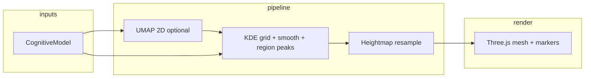

# 3D cognitive landscape (terrain)

This document describes the **architecture**, **data pipeline**, and **rendering structure** for the optional “3D landscape” tab in the cognitive results view switcher.

## Architecture

- **Source of truth:** `buildCognitiveModel()` in `src/core/cognitive-pipeline.ts` still produces the shared `CognitiveModel` (activations, joint PCA 2D plot, density grid, regions, clusters).
- **Terrain-specific pipeline:** `src/lib/cognitive-terrain-pipeline.ts` turns that model into a **heightmap** plus **marker positions** for the user and for each cognitive region.
- **UI:** `src/ui/views/Terrain3DView.tsx` is a client-only Three.js view. It is mounted from `CognitiveViewSwitcher` when the active tab is `terrain3d`.
- **Internationalisation:** Tab label and copy live under `landscape.view_*` in `messages/*.json`.

## Data pipeline

1. **Input vectors**  
   Rows of `model.allVectors` are the same multidimensional stack used for the map (activations, archetypes, extras, synthetic population), aligned to one latent width.

2. **Planar embedding (UMAP)**  
   `umap-js` fits a 2D embedding with a deterministic RNG seeded from `model.fingerprint`.  
   If UMAP fails or the sample is too small, the pipeline falls back to the **precomputed PCA density** (`model.density`) and marker positions derived from `model.centroid` / `model.cognitiveRegions` (same layout as Map/Density).

3. **Kernel density (KDE)**  
   For the UMAP path, the code reuses `computeDensityGrid` + `smoothDensityGrid` from `cognitive-pipeline.ts`, then applies the same **region-peak augmentation** used in the 2D density view so multi-modal “ridges” stay visible.

4. **Heightmap**  
   The smoothed grid is normalised by its max and **bilinearly resampled** to `(segments + 1)²` vertices. Elevation encodes relative density, not a performance score.

5. **Markers**  
   - **User:** weighted centroid of activations in the same 2D layout.  
   - **Clusters:** one ring per `CognitiveRegion`, coloured by `TRAIT_DOMAIN_HEX` and placed at the region centroid (recomputed in UMAP space when that path is active).

## Rendering code structure (`Terrain3DView.tsx`)

- **Scene:** soft hemisphere + directional light, slate background (`0xf1f5f9`).
- **Terrain:** `PlaneGeometry` rotated to lie in XZ; vertex **Y** = sampled height × `HEIGHT_SCALE`.
- **User:** small `SphereGeometry` using the same accent colour as other views (`userAccentColor` from the switcher).
- **Clusters:** flat `RingGeometry` instances, slightly above the surface, semi-transparent.
- **Controls:** `OrbitControls` with damping; **2D** locks polar angle to a top-down orbit; **3D** allows a limited polar range for a calmer feel.
- **Accessibility / UX:** `prefers-reduced-motion` slightly increases control damping and caps pixel ratio; copy stresses exploratory, non-normative framing.

## File map

| Area | Path |
|------|------|
| View type + tabs | `src/ui/views/types.ts`, `src/ui/CognitiveViewSwitcher.tsx` |
| Terrain maths | `src/lib/cognitive-terrain-pipeline.ts` |
| Three.js view | `src/ui/views/Terrain3DView.tsx` |
| Strings | `messages/en.json`, `messages/de.json`, `messages/wo.json` |
