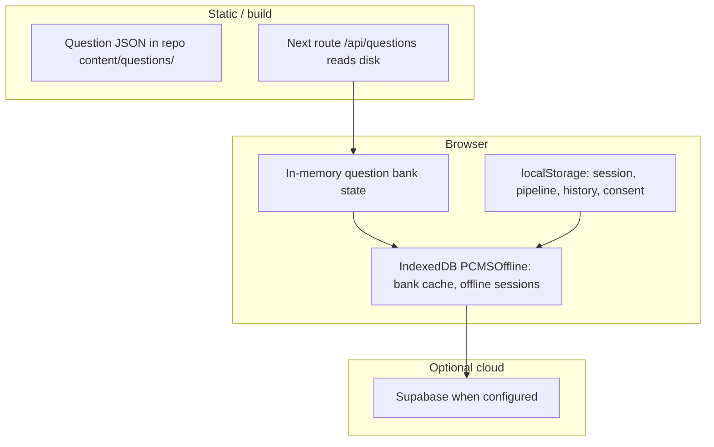

# Offline & paper-ready architecture (PCMS)

This document maps **deployment in low-connectivity or no-power contexts** (field research, clinics without reliable power, paper-first workflows) onto **what the codebase already does** and what to add next. It satisfies the design outputs: **storage design**, **sync strategy**, **fallback logic**.

## Design goals (requirements traceability)

| Requirement | Current support | Gap / next step |
|---------------|-----------------|-----------------|
| All data stored locally (JSON) | Session + profile in `localStorage`; question bank cache + offline queue in **IndexedDB**; pipeline output is JSON-serializable | Cold-start offline still needs a **seeded bank** (see fallback) |
| No dependency on APIs | **Scoring, routing, adaptive engine, cognitive map** run in the browser; **Supabase skipped** when not configured | Question bank still loads via **`/api/questions`** on first run unless cache/static seed exists |
| Sync optional | **IndexedDB → Supabase** when online + configured | None for local-only deployments |
| Local question bank | Loaded at runtime; cached in IDB after first success | Optional **bundled JSON** or **file import** for zero-network cold start |
| Local scoring | Fully client-side | — |
| Local profile storage | `pcms-pipeline-result`, `pcms-question-history` | Export/import bundles for device migration |

## 1. Storage design

### 1.1 Layers (mental model)

| Layer | Technology | Contents | Notes |
|-------|------------|----------|--------|
| **Canonical bank** | `content/questions/**/*.json` (and global bank when enabled) | `AssessmentQuestion[]` | Source of truth in repo; validated in CI |
| **API surface** | `GET /api/questions` | Same bank filtered by locale/env | Needs a running app (localhost or deployed); not “the internet” if self-hosted |
| **Memory** | `question-bank-state.ts` | Current bank for engine | Required before answering |
| **IndexedDB** | `PCMSOffline` (`src/lib/offline-storage.ts`) | `questionBanks` store: keyed by `locale|type`; `offlineSessions`: queued completions | Survives refresh; **no Supabase in this module** |
| **localStorage** | Keys such as `pcms-pipeline-result`, `pcms-question-history`, `pcms-session-id`, `pcms-consent-timestamp` | Pipeline JSON, answer history | Easy export as files; size limits ~5MB practical |
| **Optional sync** | `offline-supabase-sync.ts` | Pushes `OfflineSession` rows when online | No-op if Supabase absent |

### 1.2 JSON shapes (local-first contract)

- **Pipeline session**: `StoredPipelineSession` — portable; used for results + exports.
- **Question history**: array compatible with `QuestionResponse` — drives rescoring if replayed.
- **Offline queue**: `OfflineSession` in IDB — includes `research` + `profile` for replay to Supabase.

Keeping these **versioned** (`session.version`, assessment version strings) preserves forward compatibility when merging paper-import tools later.

## 2. Sync strategy (optional)

**When Supabase is configured**

1. During assessment, `DataCollectionService` detects `navigator.onLine === false` and **writes responses / completion to IndexedDB** (`appendOfflineResponseRow`, `attachOfflineCompletion`) instead of failing the session.
2. `OfflineSyncListener` (root layout) runs `syncPendingSessions()` on load and on **`window` `online`**.
3. `syncPendingSessions` reads `getPendingSessions()` (completed, unsynced), pushes session, responses, `research_assessments`, `profiles`, updates `sessions`, then `markSessionSynced`.

**When Supabase is not configured**

- Sync returns success with `supabase_not_configured`; data remains local only — appropriate for **air-gapped** or **paper-backed** field sites that only export JSON files.

**Manual sync / “sneakernet”**

- Export `localStorage` + IndexedDB-backed JSON exports (or a single **profile bundle** file) and move via USB; import on a connected machine — **operational procedure**, can be scripted without changing scoring.
- Queued completions in IndexedDB: the pending-sync banner offers **“Download queued sessions (JSON)”** — one `full-session` JSON per session (`buildFullSessionExportV1` in `research-session-bundle.ts`, same shape as the ZIP’s `full-session.json`).

## 3. Fallback logic

### 3.1 Question bank loading (browser)

Implemented path in `question-loader-browser.ts`:

1. **Offline**: Try **IndexedDB cache first** (`getQuestionBankCache`). If present → use immediately (no failed network round-trip).
2. **Online or cache miss**: `fetch('/api/questions?...')` → validate → `setQuestionBank` → **write cache** (`putQuestionBankCache`).
3. **Fetch fails** (network error, server down): Fall back to **IndexedDB cache** from a previous visit.
4. **No cache and no network**: Throw — user must **pre-seed** the bank (see below).

### 3.2 Cold-start offline (no prior visit)

Still a **known gap** for “fully offline on first open”. Mitigations (choose per deployment):

| Mitigation | Effort | Fit |
|------------|--------|-----|
| **Pre-open once online** on same device | Low | Train field staff to open app before leaving |
| **Ship static JSON** under `public/` + `fetch('/data/bank.json')` after app load | Medium | Works with local static server / PWA cache |
| **Bundle bank** via dynamic `import()` of JSON in client chunk | Medium | True offline-first single bundle |
| **USB / file picker** import of `bank.json` into IDB | Medium | Best for **no internet + no prior session** |
| **Paper-only** | Operational | No bank in browser until keyed (see §4) |

### 3.3 Power loss

- Answers live in memory during the session; persistence happens on **commit steps** to `localStorage` / IDB via existing questionnaire + data-collection paths. **Risk**: power loss between items loses **unsaved** progress — mitigation is frequent autosave (already present on completion paths; tighten if needed for long sessions).

## 4. Paper-based workflows (from day one)

The engine does not require paper, but **architecture should not block** these patterns:

1. **Printable instrument** — Export items from `content/questions` (or a generated PDF) for administration without a device.
2. **Capture** — Record answers on paper forms keyed by `questionId` and Likert value.
3. **Digitize** — Operator enters responses through the normal questionnaire **or** a future **bulk JSON importer** that builds `QuestionResponse[]` and runs the same scoring pipeline.
4. **Results** — Same `StoredPipelineSession` / share payloads as digital flow; **no API** required for interpretation on-device.

Treat paper as **another input channel** into the same local JSON contracts — not a second scoring model.

## 5. Related files (implementation index)

| Concern | File(s) |
|---------|---------|
| IDB schema & queue | `src/lib/offline-storage.ts` |
| Supabase push | `src/lib/offline-supabase-sync.ts` |
| Online listener | `src/components/offline/OfflineSyncListener.tsx` |
| Browser bank load + cache | `src/data/question-loader-browser.ts` |
| Server bank read | `src/app/api/questions/`, `src/data/question-loader-fs.ts` |
| Local pipeline persistence | `src/app/[locale]/questionnaire/page.tsx`, `parse-pipeline-session.ts` |
| Optional cloud | `src/lib/supabase.ts`, `DataCollectionService` |

## 6. Research ZIP export & RO-Crate

Session archives (manifest, JSON, long CSV, optional **minimal RO-Crate 1.1**) are documented in [`RESEARCH-SESSION-EXPORT.md`](RESEARCH-SESSION-EXPORT.md).

## 7. Summary

- **Local JSON + local scoring** are already core; **optional sync** to Supabase is implemented and safe to omit.
- **True first-time offline** is supported by **`/data/question-bank-universal-all.json`** (generated on `prebuild`), **Service Worker** precache, **IndexedDB** cache, and **manual JSON import** on the questionnaire page.
- **Paper** is supported by **CSV import** at `/field-import` using the same pipeline as the live questionnaire.

This keeps deployments aligned with **regions without internet or stable power**: run a **local static server** or **installed PWA**, pre-cache or side-load the bank, store profiles as **JSON files**, and sync only when infrastructure allows.
